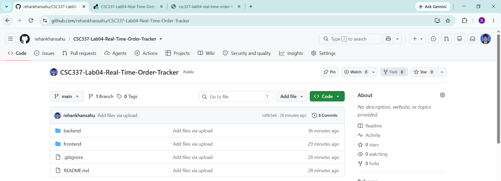
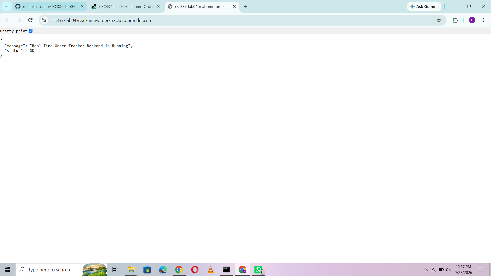
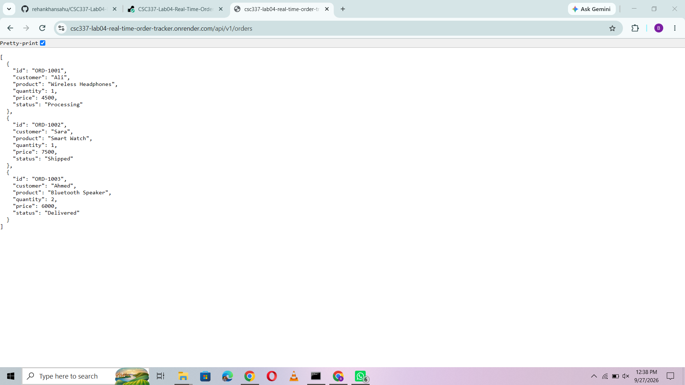
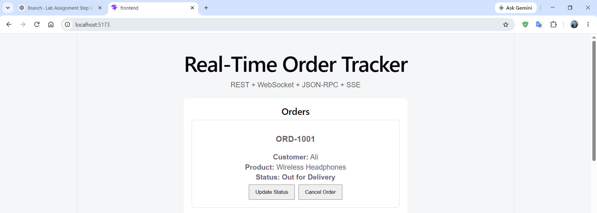
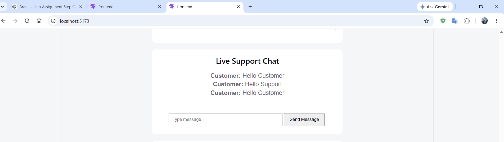
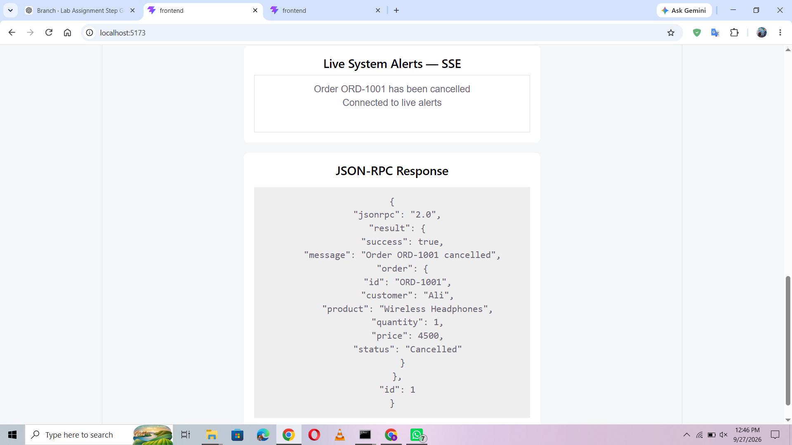

# CSC337 Lab Assignment 04

# Real-Time Order Tracker & Live Support System

A full-stack real-time web application developed for **CSC337 Lab Assignment 04**.

This project demonstrates multiple communication protocols in a single application:

* REST API
* WebSockets using Socket.IO
* JSON-RPC 2.0
* Server-Sent Events (SSE)

The system provides real-time order tracking, customer/support chat, order cancellation, and live system alerts.

---

## 📌 Project Overview

The **Real-Time Order Tracker & Live Support System** is a full-stack web application designed to demonstrate how different communication protocols can work together in a single application.

The application allows users to:

* View orders through a REST API
* View and update order status in real time
* Communicate through live customer/support chat
* Cancel orders using JSON-RPC 2.0
* Receive real-time system alerts using SSE
* Connect a React frontend with a Node.js backend

---

## 🚀 Features

### 1. REST API

The application provides REST endpoints for orders and catalog data.

#### Get All Orders

```text
GET /api/v1/orders
```

#### Get Single Order

```text
GET /api/v1/orders/:id
```

#### Get Catalog

```text
GET /api/v1/catalog
```

### Example Order

```json
{
  "id": "ORD-1001",
  "customer": "Ali",
  "product": "Wireless Headphones",
  "quantity": 1,
  "price": 4500,
  "status": "Processing"
}
```

---

# 🔴 2. WebSockets with Socket.IO

Socket.IO is used for real-time two-way communication between the frontend and backend.

### WebSocket functionality includes:

* Live order status updates
* Real-time customer/support chat
* Instant message delivery
* Real-time order update notifications

### WebSocket Events

| Event                | Purpose                        |
| -------------------- | ------------------------------ |
| `joinSupportRoom`    | Join a customer/support room   |
| `sendMessage`        | Send a chat message            |
| `receiveMessage`     | Receive a chat message         |
| `updateOrderStatus`  | Update an order status         |
| `orderStatusUpdated` | Broadcast updated order status |

### Support Room

The application uses:

```text
support-room-1001
```

for live customer/support communication.

---

# 💬 3. Live Customer Support Chat

The application provides a real-time customer/support chat using Socket.IO.

A customer can send a message from one browser tab, and another connected client in the same support room receives the message immediately without refreshing the page.

### Example

```text
Customer: Hello Support
Support: Hello Customer
```

---

# ⚡ 4. JSON-RPC 2.0

The application implements a JSON-RPC 2.0 endpoint for performing order actions.

### Endpoint

```text
POST /rpc
```

### Method

```text
cancelOrder
```

The `cancelOrder` method accepts an order ID and changes its status to:

```text
Cancelled
```

### Example Request

```json
{
  "jsonrpc": "2.0",
  "method": "cancelOrder",
  "params": {
    "orderId": "ORD-1001"
  },
  "id": 1
}
```

### Example Response

```json
{
  "jsonrpc": "2.0",
  "result": {
    "message": "Order cancelled successfully"
  },
  "id": 1
}
```

---

# 📡 5. Server-Sent Events (SSE)

Server-Sent Events are used to send real-time system alerts from the backend to connected frontend clients.

### SSE Endpoint

```text
GET /events
```

The frontend creates an `EventSource` connection with the backend.

When an important event occurs, the server sends a live notification to the frontend.

### Example

```text
Live System Alerts — SSE

Order ORD-1001 has been cancelled.
```

---

# 🏗️ System Architecture

```text
                    ┌─────────────────────────┐
                    │      React Frontend     │
                    │         + Vite          │
                    └────────────┬────────────┘
                                 │
              ┌──────────────────┼──────────────────┐
              │                  │                  │
              ▼                  ▼                  ▼
         REST API          Socket.IO              SSE
      /api/v1/orders       WebSockets           /events
              │                  │                  │
              └──────────────────┼──────────────────┘
                                 │
                                 ▼
                    ┌─────────────────────────┐
                    │      Node.js Backend    │
                    │        Express.js       │
                    └────────────┬────────────┘
                                 │
                                 ▼
                           JSON-RPC 2.0
                                /rpc
```

---

# 🛠️ Technologies Used

## Frontend

* React
* Vite
* JavaScript
* CSS
* Socket.IO Client
* EventSource API

## Backend

* Node.js
* Express.js
* Socket.IO
* CORS
* JSON-RPC 2.0
* Server-Sent Events

## Deployment

* GitHub — Source Code Repository
* Render — Backend Deployment
* Vercel — Frontend Deployment

---

# 📁 Project Structure

```text
CSC337-Lab04-Real-Time-Order-Tracker
│
├── backend
│   ├── server.js
│   ├── package.json
│   └── package-lock.json
│
├── frontend
│   ├── index.html
│   ├── src
│   │   ├── App.jsx
│   │   ├── App.css
│   │   └── main.jsx
│   ├── package.json
│   └── package-lock.json
│
├── screenshots
│   ├── 01_GitHub_Public_Repository.png
│   ├── 02_Backend_Render_Live.png
│   ├── 03_REST_API_Orders.png
│   ├── 04_WebSocket_Live_Status.png
│   ├── 05_WebSocket_Live_Chat.png
│   └── 06_JSON_RPC_Cancel_Order.png
│
├── .gitignore
└── README.md
```

---

# 🔌 API Endpoints

| Protocol  | Method    | Endpoint             | Purpose                           |
| --------- | --------- | -------------------- | --------------------------------- |
| REST      | GET       | `/api/v1/orders`     | Get all orders                    |
| REST      | GET       | `/api/v1/orders/:id` | Get a specific order              |
| REST      | GET       | `/api/v1/catalog`    | Get catalog                       |
| JSON-RPC  | POST      | `/rpc`               | Perform RPC actions               |
| SSE       | GET       | `/events`            | Receive live system alerts        |
| WebSocket | Socket.IO | `/`                  | Real-time chat and status updates |

---

# 🧪 Testing

The following features have been implemented and tested:

* REST API orders endpoint
* Live WebSocket order status updates
* Real-time customer/support chat
* JSON-RPC order cancellation
* Server-Sent Events system alerts
* Backend deployment on Render
* Frontend deployment on Vercel

---

# 📸 Screenshots

## 1. Public GitHub Repository

The project repository is publicly available on GitHub.



---

## 2. Backend Live on Render

The backend is successfully deployed and running on Render.



---

## 3. REST API Orders

The REST API returns order information in JSON format through `/api/v1/orders`.



---

## 4. WebSocket Live Order Status

The order status can be updated in real time using Socket.IO WebSockets.



---

## 5. WebSocket Live Support Chat

The customer/support chat demonstrates real-time communication between connected clients.



---

## 6. JSON-RPC Order Cancellation

The `cancelOrder` JSON-RPC method is used to cancel an order.



---

# 💻 Running the Project Locally

## Backend

Open a terminal and run:

```bash
cd backend
npm install
npm start
```

Backend:

```text
http://localhost:5000
```

## Frontend

Open another terminal:

```bash
cd frontend
npm install
npm run dev
```

Frontend:

```text
http://localhost:5173
```

---

# 🔗 Local Communication

During local development:

```text
Frontend
http://localhost:5173

        │
        ▼

Backend
http://localhost:5000
```

The frontend communicates with the backend using REST, WebSockets, JSON-RPC, and SSE.

---

# ☁️ Deployment

## Backend — Render

The backend is deployed using Render.

### Live Backend URL

https://csc337-lab04-real-time-order-tracker.onrender.com/

### Render Configuration

```text
Root Directory: backend
Build Command: npm install
Start Command: npm start
```

---

## Frontend — Vercel

The frontend is deployed using Vercel.

### Live Frontend URL

https://csc-337-lab04-real-time-order-track.vercel.app/

The Vercel frontend communicates with the deployed Render backend through the `VITE_BACKEND_URL` environment variable.

---

# 🔐 Environment Variable

For the frontend deployment, configure:

```text
VITE_BACKEND_URL=https://csc337-lab04-real-time-order-tracker.onrender.com
```

The `.env` file should not be uploaded to GitHub.

---

# 📋 Assignment Requirements

| Requirement                | Status      |
| -------------------------- | ----------- |
| REST API / GraphQL         | ✅ Completed |
| WebSockets / Socket.IO     | ✅ Completed |
| Live Customer/Support Chat | ✅ Completed |
| JSON-RPC 2.0               | ✅ Completed |
| Server-Sent Events (SSE)   | ✅ Completed |
| Backend Deployment         | ✅ Render    |
| Frontend Deployment        | ✅ Vercel    |
| Public GitHub Repository   | ✅ Completed |
| README Documentation       | ✅ Completed |
| Screenshots                | ✅ Included  |

---

# 🌐 Live Project

### Frontend

https://csc-337-lab04-real-time-order-track.vercel.app/

### Backend

https://csc337-lab04-real-time-order-tracker.onrender.com/

### GitHub Repository

```text
https://github.com/rehankhansahu/CSC337-Lab04-Real-Time-Order-Tracker
```

---

# 🎓 Course Information

**Course:** CSC337
**Assignment:** Lab Assignment 04
**Project:** Real-Time Order Tracker & Live Support System

---

# ✅ Project Status

The full-stack application has been implemented and deployed.

* **Frontend:** Vercel ✅
* **Backend:** Render ✅
* **REST API:** Working ✅
* **WebSockets:** Working ✅
* **Live Support Chat:** Working ✅
* **JSON-RPC 2.0:** Working ✅
* **SSE:** Implemented and tested ✅
* **GitHub Repository:** Public ✅
* **Documentation:** Completed ✅
